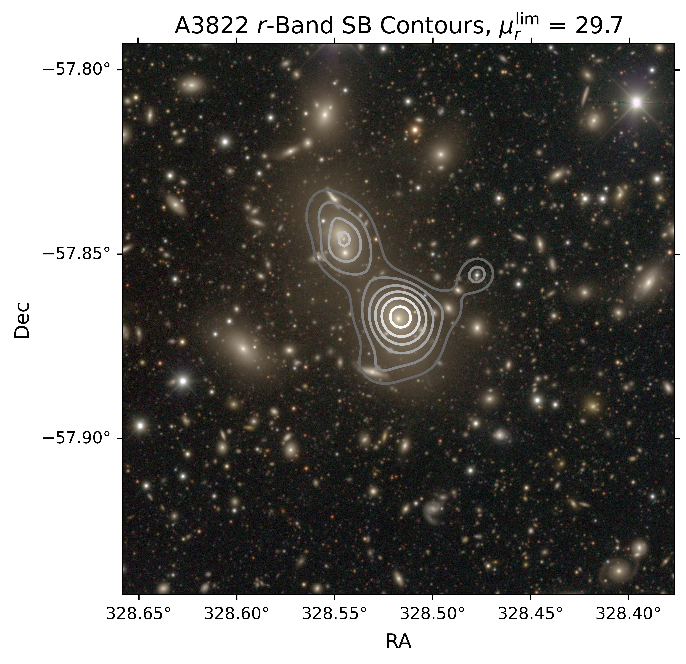
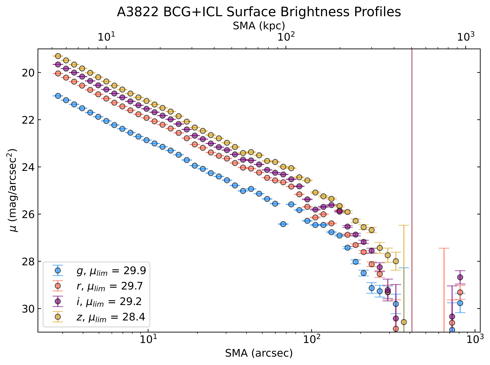

# ICL Modeling and Measurement in LoVoCCS Fields

_Author: Zacharias Escalante_

A pipeline for measuring the multi-band spatial distribution and luminous contribution of **intracluster light (ICL)** in galaxy clusters observed by the LoVoCCS survey. This repo is a condensed, standalone version of the pipeline built for a large portion of my Ph.D. dissertation work in astrophysics at Brown University.

---

## Overview

Intracluster light is a diffuse, low surface brightness light bound to a galaxy cluster's dark matter halo. Since it traces the cluster's gravitational potential, ICL is a candidate luminous probe of a cluster's dark matter distribution, but establishing that correlation requires precise, calibrated measurements from deep, wide-field imaging.

This project addresses that measurement problem using an **iterative composite modeling approach**, built from the ground up on top of data products from the [LoVoCCS data reduction pipeline](https://github.com/astroenglert/lovoccs_pipe). The primary goal is to test whether ICL correlates reliably with host cluster halo mass across a subset of LoVoCCS clusters.

The pipeline was designed to slot directly into the structure of the LoVoCCS pipeline (as of 2025), with the intent of eventual adoption as one of its primary data reduction steps, and was developed and run on [OSCAR](https://docs.ccv.brown.edu/oscar?q=distribut), Brown University's HPC cluster.

A full technical write-up of methodology, validation, and limitations is available in my [dissertation](https://repository.library.brown.edu/studio/item/bdr:fntvtnsr/).

---

## Methodology

The pipeline follows these broad steps:

1. **Gather the required inputs** - Create softlinks to input datasets, bitmasks and catalogs produced by the LoVoCCS pipeline.
2. **Compute metrics** — redshift, angular scale, Galactic extinction, etc. We need a sense of distance to the target and the conditions in this region of the sky, as well as coordinates on which to center our analysis. The pipeline makes use of measured sources magnitude deviations from `lovoccs_pipe` to generate a set of input errors to the data, to be propagated throughout the analysis.
3. **Iterative Modeling Loop** We want to minimize flux contributions from non-ICL sources in order to isolate the ICL. To do this we:
   - Run Source Extractor to unmask the central cluster region.
   - Perform 1D + 2D isophotal modeling of the brightest cluster galaxy (BCG).
   - Subtract the synthetic BCG model from the original image to isolate the ICL.
   - Re-run Source Extractor to further mask contaminating sources previously obscured by the ICL.
4. **Correct the results** We apply corrections to the ICL profiles to account for systematics like cosmological surface brightness dimming and extinction. This results in more trustworthy profiles.
5. **Generate final products** from the radial intensity profile and iteratively masked images. All products are return with propagated errors for confidence estimation:
   - Surface brightness contours mapping the spatial ICL distribution in each band.
   - Corrected 1D surface brightness profiles and color profiles.
   - Fractional luminosity contribution of ICL to total cluster light.

Results were validated against independent ICL studies of both the same target clusters, and clusters of similar redshift and dynamical environment.

---

## Repository Structure

```
.
├── src/                  # Core pipeline modules
├── config/               # Configuration files
├── notebooks/            # Exploratory analysis & compiling results
├── scripts/              # SLURM job submission scripts
├── environment.yml       # Python environment specification
├── dissertation.pdf      # Full methodology, validation, and discussion
├── run_steps_Gen3.sh     # Base shell script from which to copy templated per-cluster scripts and run ICL measurement
└── README.md
```

---

## Installation

```bash
git clone https://github.com/Zescalante/icl_pipe.git
cd icl_pipe
conda env create -f environment.yml
conda activate research
```

## Usage

Create a directory named after your cluster of choice (e.g. `A3558`), then copy in `run_steps_Gen3` and replace file paths cluster name with your own. Then simply run

```terminal
bash run_steps_Gen3.sh
```

---

## Example Output

 

---

## Results

With this measurement technique, I find ICL contributions ranging ~13-40% of the total cluster luminosity. Past composite modeling studies find ICL fractions of order ~10-30%, in broad agreement with mine. Aggregation of results across my studied clusters reveals a positive correlation of ICL luminosity with weak-lensing mass, and no significant trend of ICL fraction (L_ICL/L_total) with cluster redshift or weak-lensing derived cluster mass. See the [dissertation](dissertation.pdf) for full results, limitations, and proposed improvements.

---

## Tech Stack

Python · Pandas · NumPy / SciPy · Astropy · SLURM (OSCAR HPC) · Source Extractor

---

## Citation

If you use this pipeline or reference this work, please cite:

```
Escalante, Z., “The Intracluster Light and Weak Lensing Studies of Local Galaxy Clusters”,
Ph.D. Thesis, Brown University Library, 2026.
```
## License

This project is licensed under the MIT License. See the [LICENSE](LICENSE.txt) file for details.

## Contact

Zacharias Escalante — [zachariasescalante@gmail.com](mailto:zachariasescalante@gmail.com) · [LinkedIn](https://www.linkedin.com/in/zacharias-escalante/)
